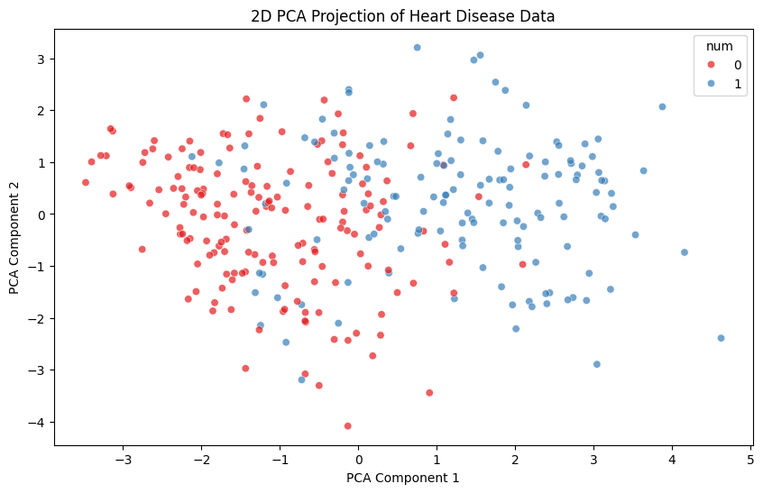
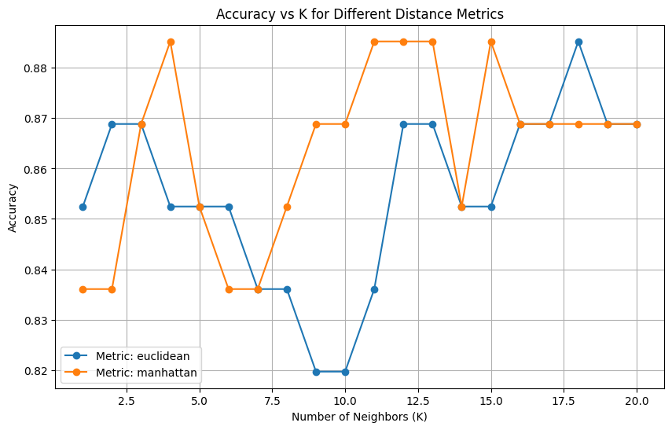
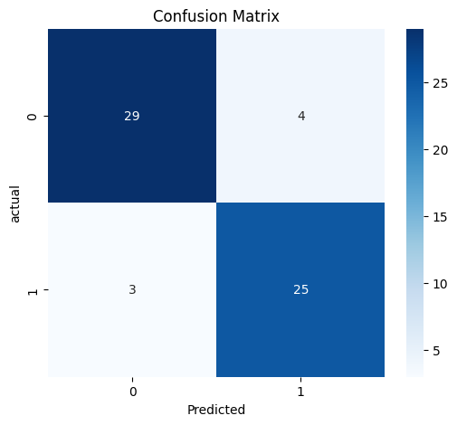

# ❤️ **Heart Disease Classification using KNN**

The project uses the **K-Nearest Neighbors (KNN)** algorithm on medical data from the **UCI Heart Disease dataset** for the prediction of heart disease.

The aim is to develop a clean and reproducible machine learning pipeline that involves preprocessing, feature selection, dimensionality analysis (PCA), training, and evaluation.

## **Overview of the Project**

Heart disease detection is a high-priority task in medical data science. This project develops a binary classification model that predicts whether a person has heart disease based on 13 medical attributes, including age, chest pain type, cholesterol level, blood pressure, and more.

The workflow includes the following:

- Loading and preparing the UCI dataset
- Handling missing values
- Scaling features
- Selecting important features based on Spearman correlation
- Applying PCA for visualization
- Training various KNN models with different hyperparameters
- Evaluating model performance using standard metrics

The final KNN model achieved **88–89% accuracy** while balanced in performance for both classes.

## Motivation

This project was created to practice building a complete machine learning pipeline using a real medical dataset. I chose the UCI Heart Disease dataset because it is a well-known benchmark in data science and provides a good mix of features for preprocessing, feature selection, and model training.

The main goal was to develop a clean and reproducible workflow that includes data preparation, exploratory analysis, PCA visualization, and tuning a KNN classifier.

## **Dataset**

**Source:** UCI Machine Learning Repository  
**Samples:** 303  
**Features:** 13 medical attributes  
**Original Target:** `num` (values 0–4 indicate disease severity)

The target was converted into a **binary classification**:

- `0` → No disease
- `1–4` → Disease

Data is loaded automatically by using:

```python
from ucimlrepo import fetch_ucirepo
heart_disease = fetch_ucirepo(id=45)
```

## **Data Preprocessing**

### Handling missing values

- Columns **ca** and **thal** contained missing values.
- Missing values were replaced using the **median** of each column.

### Feature scaling

KNN uses distance calculations, so features need to be on the same scale.  
**StandardScaler** was applied to normalize all selected features.

## **Feature Analysis & Selection**

I have used **Spearman correlation** to assess the relationship of each feature with the binary target.

Top correlated features (positive and negative):

- **thal, ca, cp, exang, oldpeak, slope, thalach**: the most correlated features (positive or negative)
- All the low-impact features like **fbs** and **chol** were removed.

The final selected features were:

```
['thal', 'ca', 'cp', 'exang', 'oldpeak', 'slope', 'sex', 'age', 'thalach']
```

## **PCA Analysis**

To visualize the structure in this dataset, **Principal Component Analysis (PCA)** was applied with 2 components.



- The first two components explained **~36%** of the total variance.
- The scatter plot displays partial separation between the two classes. Hence, KNN could be an acceptable choice.

## **Model Training (KNN)**

Data was split into:

- **80% training**
- **20% test**
- **Stratified splitting** to preserve class balance

Hyperparameters tested:

- `k` from **1 to 20**
- Distance metrics: **euclidean**, **manhattan**

The best model:

- **K = 18**
- **Metric = euclidean**
- **Accuracy = 0.8852**

A comparison plot of accuracy vs. K for both metrics was generated.



## **Model Evaluation**

The best KNN model was evaluated on the test set.

**Classification Report**

- **Accuracy:** ~89%
- **Precision:** > 0.85 for both classes
- **Recall:** > 0.88 for both classes
- **F1-score:** > 0.88 for both classes

**Confusion Matrix**  
The matrix shows a balanced performance in predicting both “no disease” and “disease” cases.



## **Project Structure**

```
Heart-Disease-Classification-KNN/
│
├── README.md
├── heart_disease_knn.ipynb       # main analysis notebook
├── requirements.txt
└── plots/                        # exported visualizations
    ├── pca_scatter.png
    ├── accuracy_vs_k.png
    └── confusion_matrix.png
```

## **How to Run**

### **Local Execution**

1. **Clone the repository**

   ```bash
   git clone https://github.com/your-username/Heart-Disease-Classification-KNN.git
   cd Heart-Disease-Classification-KNN
   ```

2. **Install the required libraries**

   ```
   pip install -r requirements.txt
   ```

3. **Run the notebook**

   Open the Jupyter notebook:

   ```
   jupyter notebook heart_disease_knn.ipynb
   ```

   Running all cells will reproduce the entire workflow.

### **Google Colab (Recommended)**

If you're using Google Colab, you can simply upload the notebook:

1. Open **Google Colab** -> File -> Upload Notebook
2. Upload `heart_disease_knn.ipynb`
3. Install dependencies inside Colab:

   ```
   !pip install ucimlrepo scikit-learn pandas numpy matplotlib seaborn
   ```

   Note: Colab already includes most libraries by default.
   You may only need to install `ucimlrepo`.

4. Run all cells

   The dataset loads automatically from the UCI repository, so no extra files are required.
